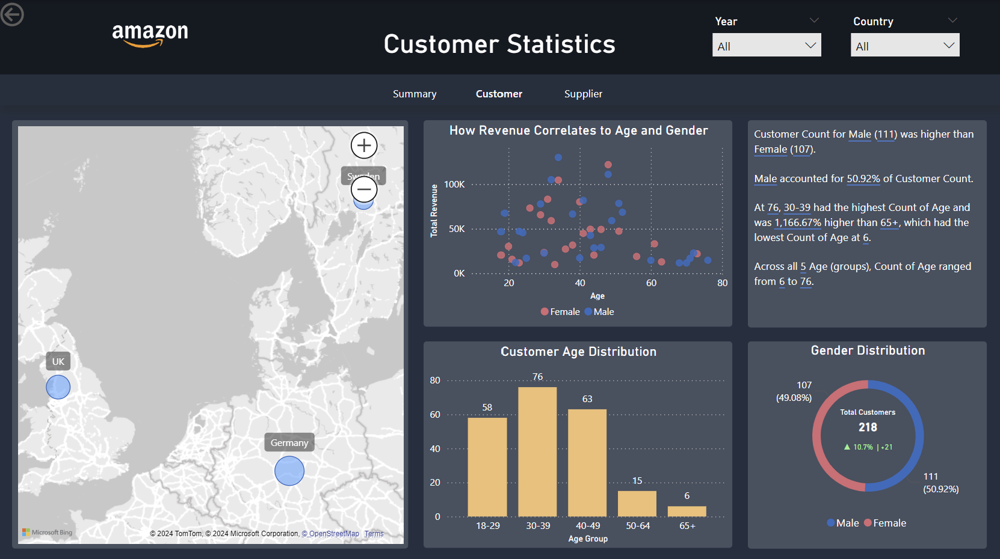

# Amazon dashboard

## Project description
The goal of the project was to create a dashboard that vizualize sales data for a company using Power BI.

# Process
The first task was to create a database and fill it with sample data that could be used to make vizualizaton with.

## Sales Page

## Customer Page

## Supplier Page

