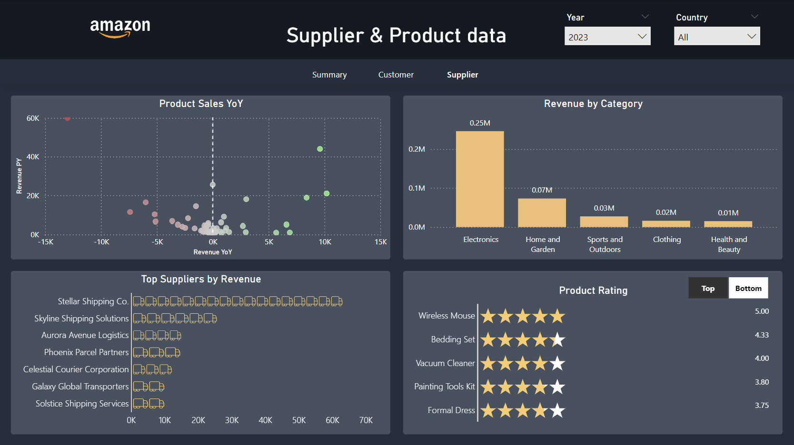

# Amazon dashboard

The goal of the project was to create a dashboard that visualizes sales data for a company using Power BI. 

## Process
### Database modelling
The first task was to create a database and fill it with sample data that could be used to make visualizations. This was achieved by first listing all the questions that the dashboard needed to answer and then starting to model a database schema that could store this information. When the database model was done and implemented in SSMS I started to fill it with data so I could later import it into Power BI.

### Layout and design
When designing the layout for the dashboard I wanted each visualization to stand on its own and not clutter every page on the dashboard with too much information, so I made sure to include alot of white space and keeping everything aligned with consistent spacing. Since I made the dashboard for a specific company in mind I wanted the dashboard to feel familiar to the company brand, so I tried to draw inspiration from their webpage by having a similar color scheme and structure on the dashboard.

## Sales Page

## Customer Page

## Supplier Page

